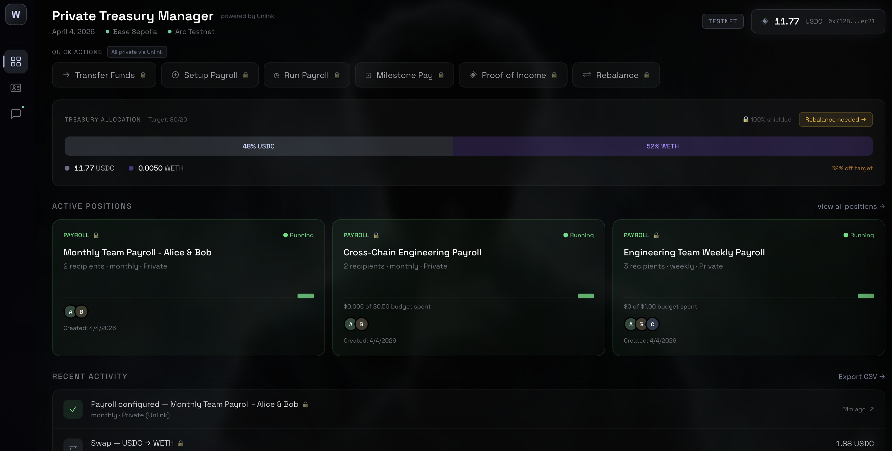
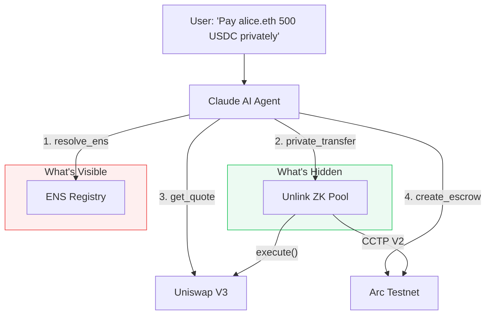

# Whisper

### Private AI Treasury Agent

> One command. Sender disappears. Payroll lands. ZK proof generated.



Every USDC payment your DAO makes is public. Competitors see your burn rate. Employees know each other's salaries. Vendors see your payment patterns.

**Whisper makes payments invisible.** Tell it who to pay and how much. Claude orchestrates the privacy routing, zero-knowledge proofs, cross-chain bridging, and escrow locking. No observer can determine who sent it, who received it, or how much was moved.

**[Live Demo](https://app-gamma-one-12.vercel.app)** | **[Verify a Payment](https://app-gamma-one-12.vercel.app/verify/alice.whisper.eth)** | **[Encrypted Tx on Basescan](https://sepolia.basescan.org/tx/0x012b697a55077aadcf983147f7da4c496ee8b2d607f95c84b3c89474fa81d920)**

---

## What We Heard

> "Everyone can see our burn rate. When we hired 3 engineers last quarter, our competitors knew before the announcement." -- DAO treasury contributor

## How It Works

One sentence in. Zero-knowledge proof out.



The agent has **25 tools** across privacy, DeFi, cross-chain bridging, smart escrow, payroll scheduling, encryption, and contact resolution. It chains them automatically. A single sentence can trigger ENS resolution, balance checks, CCTP bridging, escrow creation, and ZK proof verification, all in one turn.

## Agent Capabilities

| Tool | What Happens | Chain |
|------|-------------|-------|
| `private_transfer` | Fully shielded send. Sender, recipient, amount all hidden. | Base Sepolia |
| `batch_private_transfer` | Multi-recipient single ZK proof. One tx, everyone paid. | Base Sepolia |
| `private_swap` | Swap USDC/WETH through Unlink + Uniswap. Sender hidden. | Base Sepolia |
| `run_cross_chain_payroll` | Bridge via CCTP V2 (sender hidden) + create escrow on Arc + verify URLs. End-to-end. | Base + Arc |
| `create_escrow` | Lock funds with time-locks and oracle price triggers. Auto-release on conditions. | Arc Testnet |
| `verify_payment_proof` | Generate ZK income proof. Proves payment without revealing amount or sender. | Sepolia ENS |
| `resolve_ens` | Say "alice.eth" not "0x1234...". Resolves to shielded Unlink address automatically. | Sepolia ENS |

Plus 18 more tools for balance checks, quotes, strategy management, encrypted messaging, and contact resolution. Full reference: [Agent & Tools](docs/agent.md).

## The Privacy Network Effect

Every Whisper recipient gets an **Unlink address**. They can now send private payments themselves, even without Whisper. The privacy network grows with every payment.

## On-Chain Proof

Real operations executed on live testnets. Click to verify.

| Operation | Tx Hash | Chain |
|-----------|---------|-------|
| Private Transfer (sender hidden) | [`0x012b69...`](https://sepolia.basescan.org/tx/0x012b697a55077aadcf983147f7da4c496ee8b2d607f95c84b3c89474fa81d920) | Base Sepolia |
| WhisperEscrow Deploy | [`0x456920...`](https://testnet.arcscan.app/tx/0x456920048561473645ab154bff913a19a0b6385717e0de4434810948ef98ff13) | Arc Testnet |
| Escrow Payroll Creation | [`0x4919ff...`](https://testnet.arcscan.app/tx/0x4919ffe66f56814cae1b9ebb6720d75a0d7cad58d501da6d6ce06ed38342b8b0) | Arc Testnet |

**E2E test results:** 6/6 on-chain tests passing (check_balance, resolve_ens, verify_payment_proof, private_transfer, check_escrow, private_cross_chain_transfer).

## Documentation

| | |
|---|---|
| **[System Architecture](docs/architecture.md)** | How every component connects. 5 Mermaid diagrams covering the full system. |
| **[Agent & Tools](docs/agent.md)** | All 25 tools, how the agent chains them, strategy templates. |
| **[Privacy Model](docs/privacy.md)** | What's hidden per operation, encrypted messaging, privacy score. |

**Architecture Decisions:**
[Private DeFi Swaps](docs/decisions/001-unlink-execute-for-private-swaps.md) | [Smart Escrow](docs/decisions/002-milestone-escrow-over-streaming.md) | [Direct Signing](docs/decisions/003-direct-signing-over-capability-kernel.md) | [Cross-Chain CCTP](docs/decisions/004-cross-chain-private-payroll-via-unlink-cctp.md)

## Built With

| | |
|---|---|
| **[Unlink](https://docs.unlink.xyz/)** | Zero-knowledge privacy pool. The only ZK protocol with `execute()` for arbitrary DeFi calls. |
| **Uniswap Trading API** | Production-grade token routing with UniswapX gasless orders. |
| **Arc Testnet** | Settlement layer for smart escrow with time-locks and oracle price triggers. |
| **Claude (Anthropic)** | Claude Sonnet 4 with `tool_use`. 25 tools, streaming SSE, autonomous multi-step execution. |
| **Circle CCTP V2** | Cross-chain USDC bridging. Burn on Base, mint on Arc. 7-parameter `depositForBurn`. |
| **Base Sepolia** | Privacy layer. Unlink pool + CCTP bridge origin. |

## Quick Start

```bash
git clone https://github.com/0x2kNJ/whisper.git && cd whisper

cp .env.example .env    # Fill in values below

cd agent && npm install
npm run test            # 3 unit tests

cd ../app && npm install && npm run dev
```

**Required Environment Variables:**

| Variable | Where to Get It |
|----------|----------------|
| `PRIVATE_KEY` | Any EVM wallet private key (for signing transactions) |
| `UNLINK_MNEMONIC` | 12-word seed phrase for your Unlink account |
| `ANTHROPIC_API_KEY` | [console.anthropic.com](https://console.anthropic.com/) |
| `UNISWAP_API_KEY` | [Uniswap Trading API](https://trade-api.gateway.uniswap.org) |
| `UNLINK_API_KEY` | [Unlink developer portal](https://docs.unlink.xyz/) |
| `BASE_SEPOLIA_RPC_URL` | [Alchemy](https://www.alchemy.com/) or [Infura](https://www.infura.io/) (Base Sepolia) |

`ARC_RPC_URL` defaults to `https://rpc.testnet.arc.network` (no key needed). Token addresses and contract addresses are pre-configured in `agent/src/config.ts`.

**Testnet USDC:** Get Base Sepolia USDC from the [Circle faucet](https://faucet.circle.com/).

## Deployed Contracts

| Contract | Address | Chain | Explorer |
|----------|---------|-------|----------|
| WhisperVault | `0x86848019781cfd56A0483C17904a80Ca7C4F09B1` | Base Sepolia | [View](https://sepolia.basescan.org/address/0x86848019781cfd56A0483C17904a80Ca7C4F09B1) |
| WhisperEscrow | `0xf4e13a7d98A8Eb7945D937Fa33e5BBa287329eD6` | Arc Testnet | [View](https://testnet.arcscan.app/address/0xf4e13a7d98A8Eb7945D937Fa33e5BBa287329eD6) |

## Project Structure

```
whisper/
├── contracts/     Foundry -- WhisperVault + WhisperEscrow (Solidity 0.8.24)
├── agent/         Claude AI -- 25 tools, Unlink SDK, Uniswap API, CCTP V2
├── app/           Next.js 14 -- Treasury Dashboard, Chat Sidecar, 10 API routes (SSE)
└── docs/          Architecture, privacy model, 4 ADRs
```

## Bounty Tracks

| Sponsor | What We Built | Key Evidence |
|---------|-------------|-------------|
| **Unlink** | First project to compose `execute()` with CCTP V2 for cross-chain privacy. Batch private transfers via single ZK proof. Full SDK integration (deposit, transfer, batch, execute, getBalances). | [ADR-001](docs/decisions/001-unlink-execute-for-private-swaps.md), [ADR-004](docs/decisions/004-cross-chain-private-payroll-via-unlink-cctp.md), [Privacy Model](docs/privacy.md) |
| **Arc** | Smart escrow with time-locks + oracle price triggers. Bonus pay releases when conditions are met. Pro-rata distribution via basis-point shares. | [ADR-002](docs/decisions/002-milestone-escrow-over-streaming.md), [WhisperEscrow contract](https://testnet.arcscan.app/address/0xf4e13a7d98A8Eb7945D937Fa33e5BBa287329eD6) |
| **Uniswap** | Private token swaps routed through Unlink's ZK pool. On-chain quote fallback for testnet. Trading API integration with UniswapX support. | [Architecture](docs/architecture.md), [`agent/src/uniswap.ts`](agent/src/uniswap.ts) |
| **Anthropic** | Claude agent with 25 `tool_use` tools. Streaming SSE with real-time tool call visibility. Autonomous multi-step reasoning (ENS resolve to transfer to verify). End-to-end cross-chain payroll in one command. | [Agent & Tools](docs/agent.md), [`agent/src/agent.ts`](agent/src/agent.ts) |

---

Built at **ETHGlobal Cannes 2026** | MIT License
