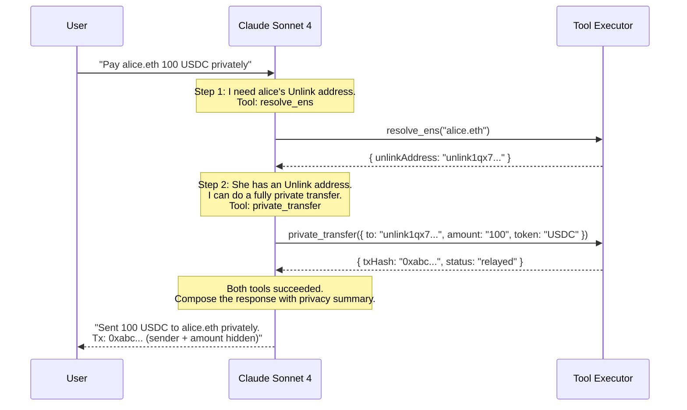
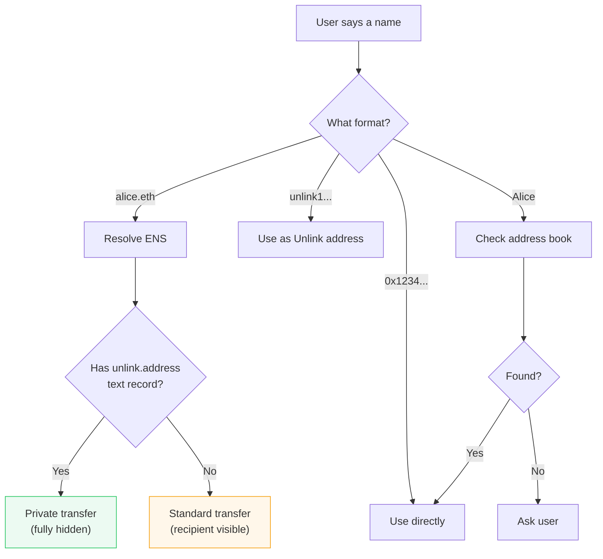

# AI Agent & Tools

> "Pay the team 500 USDC each, privately, every two weeks."
>
> That sentence triggers ENS resolution, Unlink transfers, strategy creation, and payroll scheduling. One sentence, four backend systems, zero user interaction with wallets.

Whisper's agent is built on Claude with Anthropic's `tool_use` protocol. It has 25 tools across 7 categories, and it chains them automatically based on what the user asks for.

## How the Agent Thinks

The agent doesn't just map commands to tools. It reasons about the best path. Here's a real example:



**Key behaviors:**
- **No confirmations.** The agent executes immediately. Users said "pay," not "should I pay?"
- **Privacy by default.** If a recipient has an Unlink address, the agent uses `private_transfer`. Always.
- **Automatic chaining.** The agent resolves ENS names, checks balances, and gets quotes before executing, all in one turn.
- **Max 10 rounds.** Each turn can chain up to 10 tool calls. Most operations need 2-3.

## Tool Definition Format (Anthropic tool_use)

Every tool is defined in the Anthropic `tool_use` schema and passed to Claude at the start of each conversation. Here's the actual definition for `private_transfer`, the most-used tool:

```json
{
  "name": "private_transfer",
  "description": "Send tokens privately via the Unlink protocol. The transfer is shielded — neither the sender, recipient, nor amount are publicly visible on-chain.",
  "input_schema": {
    "type": "object",
    "properties": {
      "recipient": {
        "type": "string",
        "description": "Recipient Unlink address (unlink1...) or ENS name"
      },
      "token": {
        "type": "string",
        "description": "Token symbol to send (e.g. \"USDC\")"
      },
      "amount": {
        "type": "string",
        "description": "Human-readable amount to send (e.g. \"50\")"
      }
    },
    "required": ["recipient", "token", "amount"]
  }
}
```

Claude reads the `description` field to decide when to use each tool. The `input_schema` constrains what Claude can pass. The `executeTool()` dispatcher in `tools.ts` receives the tool name + input, resolves any ENS names, calls the appropriate backend SDK, and returns a JSON result that Claude incorporates into its response.

**To add a new tool:** Define the schema in `toolDefinitions[]`, add a case to `executeTool()`, and Claude will automatically discover and use it based on the description.

## The 25 Tools

### Privacy (5 tools) -- the core value

These are the tools that make Whisper different from every other treasury agent.

| Tool | What It Does | Inputs |
|------|-------------|--------|
| `check_balance` | Private USDC/WETH balances from ZK pool | -- |
| `private_transfer` | Fully shielded send (sender + recipient + amount hidden) | `recipient`, `token`, `amount` |
| `batch_private_transfer` | Multi-recipient single ZK proof (faster, avoids UTXO contention) | `recipients[]` |
| `deposit_to_unlink` | Move tokens from public wallet into privacy pool | `token`, `amount` |
| `private_cross_chain_transfer` | Bridge USDC to Arc via CCTP V2, sender hidden | `amount`, `recipient` |

### DeFi (2 tools) -- private swaps

| Tool | What It Does | Inputs |
|------|-------------|--------|
| `get_quote` | Uniswap V3 price quote with impact and routing | `tokenIn`, `tokenOut`, `amount` |
| `private_swap` | Swap tokens through Unlink execute() + Uniswap | `tokenIn`, `tokenOut`, `amount` |

The swap flow: withdraw from pool -> approve router -> swap on Uniswap -> re-deposit output. The sender is the Unlink adapter, not the agent wallet. See [ADR-001](./decisions/001-unlink-execute-for-private-swaps.md).

### Escrow & Cross-Chain (3 tools) -- smart payroll on Arc

| Tool | What It Does | Inputs |
|------|-------------|--------|
| `create_escrow` | Deploy smart escrow on Arc Testnet | `recipients[]`, `milestones[]` |
| `check_escrow` | Query payroll status, milestones, conditions | `payrollId` |
| `run_cross_chain_payroll` | End-to-end: bridge via CCTP V2 (sender hidden) + create escrow + generate verify URLs | `recipients[]`, `milestones[]` |

Each milestone can have a **time lock** (release after date) and/or an **oracle trigger** (release when ETH price crosses a threshold). Pro-rata distribution to multiple recipients via basis-point shares. `run_cross_chain_payroll` chains the entire flow: resolve ENS, bridge via CCTP V2, wait for attestation, create escrow, generate verify URLs. See [ADR-002](./decisions/002-milestone-escrow-over-streaming.md).

### Strategy Management (8 tools) -- recurring payments

| Tool | What It Does |
|------|-------------|
| `create_strategy` | Create a recurring payment plan (weekly/biweekly/monthly) |
| `list_strategies` | List all strategies with status filter |
| `get_strategy` | Get details, execution history, spend tracking |
| `pause_strategy` / `resume_strategy` | Toggle strategy execution |
| `edit_strategy` | Update recipients, amounts, schedule |
| `execute_strategy` | Dry-run to preview what would execute |
| `schedule_payroll` | Create EIP-191 signed payroll config with automatic scheduling |

**Four strategy templates:**

| Template | Example |
|----------|---------|
| `standard_payroll` | "Pay Alice, Bob, Carol 2,000 USDC each, weekly" |
| `vesting_schedule` | "Vest 50,000 tokens to co-founder over 12 months" |
| `performance_bonus` | "Pay trading desk 5,000 USDC when ETH crosses $4,000" |
| `contractor_payment` | "Pay contractor 10,000 USDC on delivery" |

### Encryption (2 tools) -- encrypted payroll messages

| Tool | What It Does |
|------|-------------|
| `encrypt_payroll_message` | Encrypt payroll instructions with NaCl box (X25519) |
| `decrypt_payroll_message` | Decrypt with recipient's secret key |

Encrypted payroll instructions are stored as hex-encoded ciphertext in ENS text records. On-chain observers see random bytes. Only the keyholder sees the actual payment details.

### Contacts & Resolution (4 tools) -- address management

| Tool | What It Does |
|------|-------------|
| `save_contact` / `lookup_contact` / `list_contacts` | Local address book CRUD |
| `resolve_ens` | ENS name to address + Unlink address resolution |
| `verify_payment_proof` | Verify income via ENS text record ZK proof |

## Recipient Resolution

When you say a name, the agent figures out where to send:



The priority is always: **if there's an Unlink address available, use it.** This maximizes privacy without the user having to think about it.

## Source Code

| File | What's Inside |
|------|--------------|
| [`agent/src/agent.ts`](../agent/src/agent.ts) | Main loop, system prompt, Claude API streaming |
| [`agent/src/tools.ts`](../agent/src/tools.ts) | 25 tool definitions + `executeTool()` dispatcher |
| [`agent/src/unlink.ts`](../agent/src/unlink.ts) | Unlink SDK wrapper (deposit, transfer, execute, batch) |
| [`agent/src/uniswap.ts`](../agent/src/uniswap.ts) | Uniswap Trading API + on-chain quote fallback |
| [`agent/src/strategies.ts`](../agent/src/strategies.ts) | Strategy CRUD, templates, execution tracking |
| [`agent/src/scheduler.ts`](../agent/src/scheduler.ts) | 60-second payroll scheduler + EIP-191 signature verification |
| [`agent/src/messaging.ts`](../agent/src/messaging.ts) | NaCl box encryption/decryption for payroll messages |
| [`agent/src/addressBook.ts`](../agent/src/addressBook.ts) | Contact storage + ENS resolution |
| [`agent/src/config.ts`](../agent/src/config.ts) | Chain configs, contract addresses, token registry |
