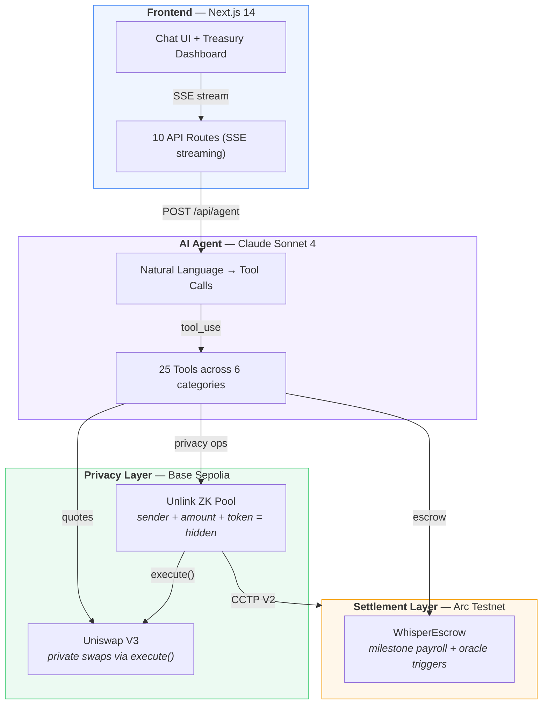
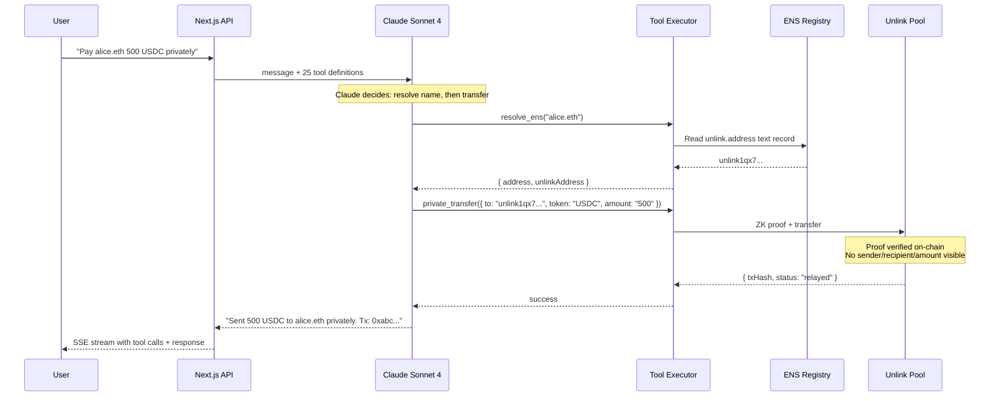
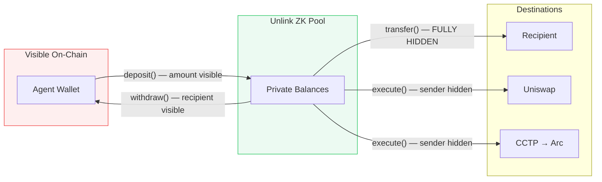
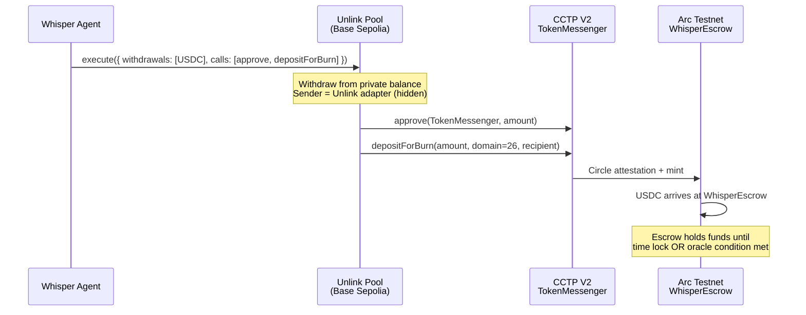
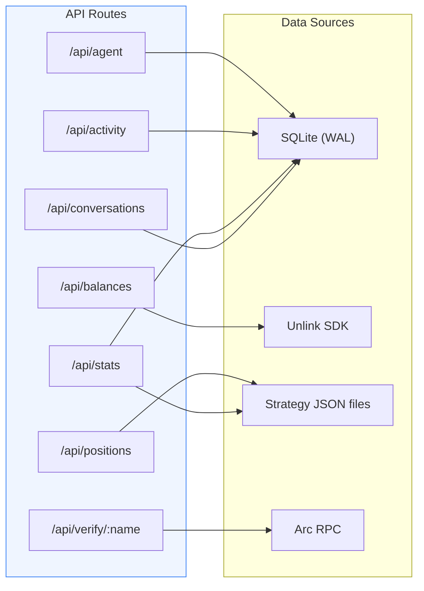

# System Architecture

> One sentence in. Zero-knowledge proof out. That's the whole system.

Whisper turns "pay alice 500 USDC" into a fully shielded on-chain transaction where no observer can determine who sent it, who received it, or how much was moved. This document shows how every component connects to make that happen.

## The Big Picture

Four layers. Each one does exactly one job.

**Why this architecture:** The agent sits between the user and every backend. The user never touches a wallet, signs a transaction, or thinks about which chain to use. They just say what they want. The agent figures out the routing, the privacy, and the execution.

> Design rationale for each major decision lives in the [Architecture Decision Records](./decisions/).

## How a Payment Actually Works

This is the real sequence. A user types one sentence. The system makes 4 calls across 2 protocols in under 10 seconds.

**What a Basescan observer sees:** The Unlink pool contract emitted an event. That's it. No sender address. No recipient. No amount. No token type. [See a real encrypted transaction on Basescan](https://sepolia.basescan.org/tx/0x012b697a55077aadcf983147f7da4c496ee8b2d607f95c84b3c89474fa81d920).

## The Privacy Layer

This is the core innovation. Every payment routes through Unlink's ZK pool on Base Sepolia. Different operations hide different things:

| Operation | What's Hidden | What's Visible |
|-----------|--------------|----------------|
| **transfer()** | Sender, recipient, amount, token | *Nothing* |
| **execute()** | Sender, amount, token | Target contract call |
| **deposit()** | Recipient (pool address) | Depositor, amount |
| **withdraw()** | Sender (pool address) | Recipient, amount |

> Deep dive: [Privacy Model](./privacy.md) covers the full privacy scope, encrypted messaging, and privacy score calculation.

## Cross-Chain: Base Sepolia to Arc

The most technically ambitious flow. Private USDC on Base Sepolia bridges to Arc Testnet for milestone-based escrow, using Unlink's `execute()` to call Circle's CCTP V2. The sender stays hidden throughout.

**Why this matters:** The sender is the Unlink adapter contract, not the agent wallet. Nobody watching Base Sepolia can link this bridge transaction to the DAO. See [ADR-004](./decisions/004-cross-chain-private-payroll-via-unlink-cctp.md) for the full design.

## The Data Layer

Every API route has exactly one data source. No complex joins, no shared state between routes.

## Contract Addresses

All verified, all on testnets.

| Contract | Address | Chain | What It Does |
|----------|---------|-------|-------------|
| **WhisperVault** | [`0x8684...09B1`](https://sepolia.basescan.org/address/0x86848019781cfd56A0483C17904a80Ca7C4F09B1) | Base Sepolia | USDC vault with agent spend authorization |
| **WhisperEscrow** | [`0xf4e1...9eD6`](https://testnet.arcscan.app/address/0xf4e13a7d98A8Eb7945D937Fa33e5BBa287329eD6) | Arc Testnet | Smart escrow with time-locks + oracle price triggers |
| **Unlink Pool** | `0x647f...f482` | Base Sepolia | ZK privacy pool for all transfers |
| **CCTP V2** | `0x8FE6...2DAA` | Base Sepolia | Cross-chain USDC bridge to Arc |

**Supported Tokens:**

| Token | Base Sepolia | Arc Testnet |
|-------|-------------|-------------|
| USDC (6 decimals) | `0x036CbD53842c5426634e7929541eC2318f3dCF7e` | `0x3600000000000000000000000000000000000000` |
| WETH (18 decimals) | `0x4200000000000000000000000000000000000006` | -- |

## Tech Stack

| Component | Tech | Why |
|-----------|------|-----|
| **Chat + Dashboard** | Next.js 14, React 18, Tailwind | SSE streaming, glassmorphism UI, treasury dashboard |
| **AI Agent** | Claude (tool_use) | 25 tools, streaming SSE, autonomous multi-step execution |
| **Privacy** | Unlink SDK (`@unlink-xyz/sdk`) | Only ZK protocol with `execute()` for arbitrary DeFi calls |
| **Swaps** | Uniswap Trading API | Production routing, UniswapX gasless orders |
| **Escrow** | Solidity 0.8.24 (Foundry) | Milestone payroll with oracle price triggers |
| **Encryption** | tweetnacl (X25519 + XSalsa20) | NaCl box for encrypted payroll instructions |
| **Database** | better-sqlite3 (WAL mode) | Zero-config, perfect for hackathon velocity |

## Related

- [Agent & Tools Reference](./agent.md) -- all 23 tools with inputs, outputs, backends
- [Privacy Model](./privacy.md) -- what's hidden, encryption, privacy score
- [ADR-001](./decisions/001-unlink-execute-for-private-swaps.md) -- why `execute()` for swaps
- [ADR-002](./decisions/002-milestone-escrow-over-streaming.md) -- milestone escrow vs streaming
- [ADR-003](./decisions/003-direct-signing-over-capability-kernel.md) -- direct signing tradeoffs
- [ADR-004](./decisions/004-cross-chain-private-payroll-via-unlink-cctp.md) -- cross-chain CCTP design
