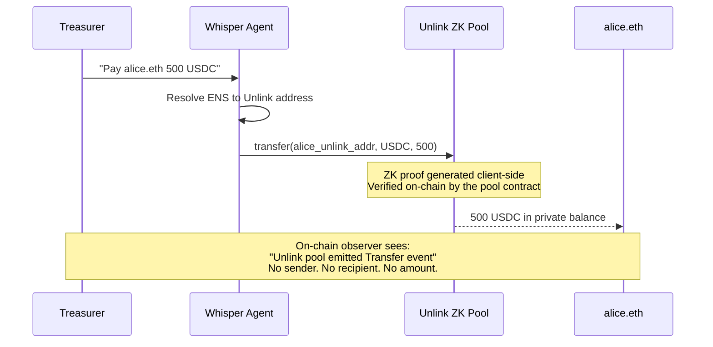
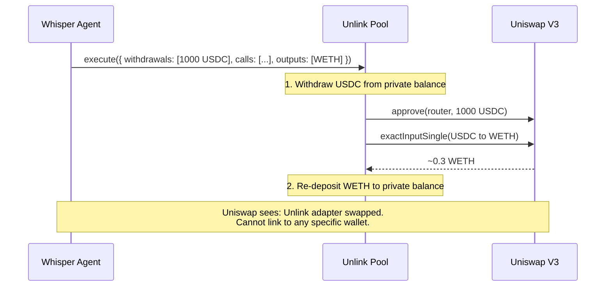
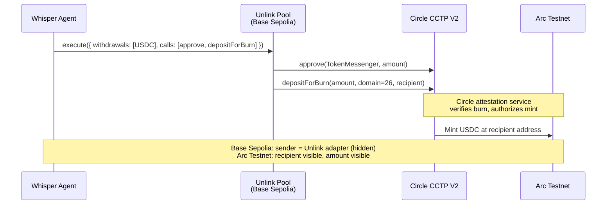
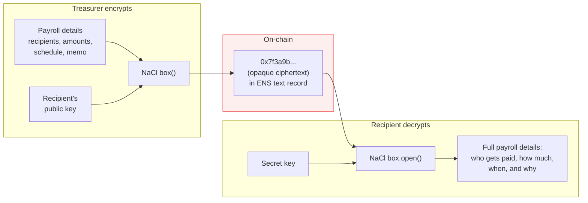

# Privacy Model

> Your competitor just checked your DAO's wallet on Etherscan. They know you hired 3 people last month, what you're paying them, and which vendors you use. With Whisper, they see nothing.

Whisper uses [Unlink](https://docs.unlink.xyz/) to make every payment invisible. Zero-knowledge proofs generated client-side. No trusted intermediary. No metadata leakage.

> See the visual comparison live: [whisper/privacy](https://app-gamma-one-12.vercel.app/privacy)

## What Competitors See: Before and After

This is the pitch. This is why Whisper exists.

| Scenario | Without Whisper (public) | With Whisper (private) |
|----------|------------------------|----------------------|
| **Payroll** | "0xDAO sent 5,000 USDC to 0xAlice, 8,000 USDC to 0xBob" | Pool emitted an event. No sender. No recipient. No amount. |
| **Vendor payment** | "0xDAO paid 50,000 USDC to 0xVendor on March 1st" | Nothing visible. Fully shielded transfer. |
| **Token swap** | "0xDAO swapped 10,000 USDC for WETH on Uniswap" | Unlink adapter called Uniswap. Cannot link to any wallet. |
| **Burn rate** | Sum all outgoing transfers. Calculable in seconds. | Cannot be calculated. Transaction amounts are hidden. |
| **Salary data** | Cross-reference transfer amounts per address. | Each recipient gets a unique Unlink address. No correlation. |

## How It Works: The Privacy Scope

Unlink is a smart contract deployed directly on Base Sepolia. The SDK generates zero-knowledge proofs client-side, the pool verifies them on-chain. Different operations hide different things:

| Operation | Sender | Recipient | Amount | Token |
|-----------|--------|-----------|--------|-------|
| **transfer()** | **Hidden** | **Hidden** | **Hidden** | **Hidden** |
| **execute()** | **Hidden** | Visible | **Hidden** | **Hidden** |
| **deposit()** | Visible | **Hidden** | Visible | Visible |
| **withdraw()** | **Hidden** | Visible | Visible | Visible |

**`transfer()` is full privacy.** This is what Whisper uses for every standard payment. Both parties are hidden. The amount is hidden. Even the token type is hidden. An observer sees pool contract activity and nothing else.

**`execute()` enables private DeFi.** When Whisper swaps tokens on Uniswap or bridges via CCTP, it uses `execute()` to interact with external contracts while keeping the sender hidden. The Uniswap router sees the Unlink adapter, not your wallet. See [ADR-001](./decisions/001-unlink-execute-for-private-swaps.md).

## Privacy Flows

### Fully Private Payment

The simplest and most common flow. One sentence from the user, full privacy for both parties.



### Private Swap (USDC to WETH)

Swap tokens without revealing who's swapping. The Unlink adapter calls Uniswap, not your wallet.



### Private Cross-Chain Bridge (Base to Arc)

Bridge USDC from Base Sepolia to Arc Testnet for escrow payroll. Sender stays hidden on both chains.



## Encrypted Payroll Messages

Unlink hides transfers. But what about the payroll *instructions* themselves? Whisper encrypts them with NaCl box (X25519 + XSalsa20-Poly1305) and stores the ciphertext in ENS text records.



**Three levels of access:**

| Who | What They See |
|-----|-------------|
| **On-chain explorer** | `0x7f3a9b...` random hex in an ENS text record |
| **Anyone without the key** | Noise. No structure, no metadata, no hint of content. |
| **Recipient with secret key** | Full payroll instruction: names, amounts, schedule, memo |

This means a DAO treasurer can post proof of payment on-chain (the ciphertext exists, it's verifiable) while keeping the actual payment details completely private.

## Privacy Score

The dashboard tracks how private your treasury operations are:

```
Privacy Score = (private_tx_count / total_tx_count) * 100
```

**Counts as private:** `private_transfer`, `batch_private_transfer`, `private_swap`

**Counts as total (also includes):** `deposit_to_unlink`, `create_escrow`, `schedule_payroll`, `execute_strategy`

A treasury running 100% through Whisper's private transfer tools scores 100%. The score is calculated monthly and displayed on the dashboard.

## The Network Effect

This is the part that compounds.

Every Whisper recipient gets an **Unlink address**. That address isn't tied to Whisper. It's a standard Unlink account. The recipient can now:

1. Receive private payments from anyone (not just Whisper users)
2. Send private payments themselves
3. Use `execute()` for private DeFi interactions

**Every payment Whisper makes grows the privacy network.** The more people with Unlink addresses, the larger the anonymity set for everyone. This is the flywheel.

## Operational Privacy Considerations

Unlink's protocol-level guarantees are strong. But privacy also depends on how the system is used in practice:

**Anonymity set size.** Transfer privacy is proportional to pool utilization. A pool with one depositor provides weaker guarantees than a pool with thousands. On testnet, the anonymity set is small. On mainnet, it would grow with adoption. Whisper's network effect (every recipient gets an Unlink address) is designed to grow the set over time.

**Timing correlation.** If a DAO deposits 50,000 USDC and a 50,000 USDC transfer occurs 3 minutes later, a motivated observer could infer a connection. Mitigation: Whisper deposits funds proactively, not just-in-time. The agent maintains a private balance and transfers from it, breaking the temporal link between deposit and spend.

**Deposit/withdrawal amount correlation.** Depositing and withdrawing the same unusual amount (e.g., 47,392.18 USDC) can be correlated even without sender/recipient data. Mitigation: Whisper uses round-number deposits and keeps a standing balance in the pool rather than depositing exact payment amounts.

**Single-agent risk.** Whisper's agent holds one signing key (see [ADR-003](./decisions/003-direct-signing-over-capability-kernel.md)). In production, this would need multi-sig control, key rotation, and hardware security module integration. The current design is appropriate for testnet demonstration.

These are not weaknesses of Unlink's ZK proofs. They are operational considerations for any privacy system. Whisper's architecture is designed to mitigate them, and mainnet deployment would include additional safeguards.

## Unlink SDK Methods

For full documentation: [docs.unlink.xyz](https://docs.unlink.xyz/)

| Method | What Whisper Uses It For |
|--------|------------------------|
| `deposit()` | `deposit_to_unlink` tool -- move tokens into privacy pool |
| `transfer()` | `private_transfer` + `batch_private_transfer` -- fully shielded payments |
| `execute()` | `private_swap` + `private_cross_chain_transfer` -- private DeFi and bridging |
| `withdraw()` | Internal only -- for public operations that need tokens outside the pool |
| `getBalances()` | `check_balance` tool -- query private token balances |

## Related

- [System Architecture](./architecture.md) -- full component diagram and data flows
- [Agent & Tools Reference](./agent.md) -- all 23 tools with usage details
- [ADR-001: Private DeFi Swaps](./decisions/001-unlink-execute-for-private-swaps.md)
- [ADR-004: Cross-Chain CCTP](./decisions/004-cross-chain-private-payroll-via-unlink-cctp.md)
